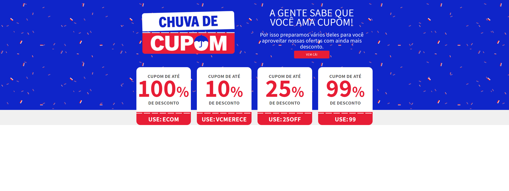

## Desktop

<h1 align="center">
    
</h1>

<br>

## Mobile

<h1 align="center">
    
</h1>

<br>

## ⚙️ Tecnologias

Este projeto foi desenvolvido utilizando:

- [HTML](https://developer.mozilla.org/pt-BR/docs/Web/HTML)
- [CSS](https://developer.mozilla.org/pt-BR/docs/Web/CSS)
- [JavaScript](https://developer.mozilla.org/pt-BR/docs/Web/JavaScript)
- [Liquid](http://docs.edools.com/file.03_conhecendo_o_liquid.html)
- [Shopify](https://www.shopify.com/br)

## 📌 Começando

Adicione o código no seu tema:

```bash
No site da shopify vá em "Loja virtual" > "Temas",
Em temas clique nos 3 pontinhos (...) e "Editar código",
Vá na pasta "Seções", + Adicionar uma nova seção,
Deixe marcado a opção "liquid" e adicione um nome para o arquivo e pronto,
Dentro do aquivo criado cole o código desse repositório.
Pronto.
```

Adicionando a seção criada no seu tema:

```bash
No site da shopify vá em personalizar seu tema,
Em adicionar seção procure por "CUPONS",
Pronto, personalize como desejar.
```

## 🖼️ Layout

- [Teste para Desenvolvedor FrontEnd da Astron Ecom](https://mm.tt/2141733701?t=WZBzUJIj62)
- [Imagem Layout](https://drive.google.com/file/d/1og7KPABBfA_yCb5leMN-dSKDpPCbI45g/view)
